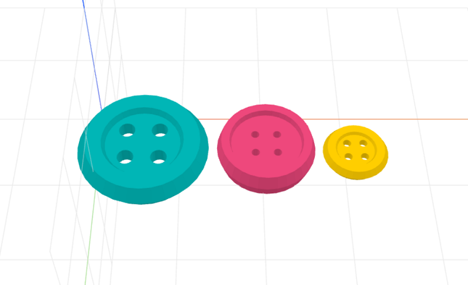

# craft-button-calebhsu

Parameterized button model.

### Install
    $ npm install craft-button-calebhsu

### Parameters
- width: adjusts width of button
- height: adjusts thickness of button

### Example
```html
<craft>
    <craft name="button" module="calebhsu/craft-button"/>
    <row>
        <scale factor="3">
            <button></button>
        </scale>
        <button width="10" height="3"></button>
        <button></button>
    </row>
</craft>
```

